<h3><code>shahmirkhan106@github:~$ ./contributions.sh</code></h3>

  

<h3><code>shahmirkhan106@github:~$ whoami</code></h3>

<table>
  <tr>
    <td valign="top" width="256"></td>
    <td valign="top" width="512"></td>
  </tr>
</table>

 

<h3><code>shahmirkhan106@github:~$ ls ./projects</code></h3>

<table>
  <tr>
    <td valign="top" width="50%">

**<`/pakistan-flood-intelligence`** — flood-risk prediction by province from real Sentinel-1 / SMAP / CHIRPS satellite data. Random Forest + Gradient Boosting ensemble behind a Streamlit map. ★ 1

  

**<`/ai-agent-security-paper`** — detecting prompt-injection attacks in LLM-based autonomous agent systems.

  

**<`/ai-youtube`** — pipeline that generates and publishes YouTube shots automatically.

    </td>
    <td valign="top" width="50%">

**<`/LuckyAI`** · **<`/Codelens_Bob_Hackathon`** — TypeScript and Python builds.

  

**<`/Real-Time-Face-Recognition-System`** — OpenCV face encodings with Euclidean-distance matching off a live webcam feed.

  

**[portfolio →](https://shahmirkhan106.github.io)**

    </td>
  </tr>
</table>

 

<h3><code>shahmirkhan106@github:~$ cat ./contact</code></h3>

  <a href="https://github.com/shahmirkhan106?tab=repositories">github.com/shahmirkhan106</a>
  &nbsp;·&nbsp;
  <a href="https://shahmirkhan106.github.io">shahmirkhan106.github.io</a>

 

  The panels above are SVGs generated by <code>scripts/</code> and refreshed by a
  daily GitHub Action — no third-party stats service, no token, no JavaScript.

